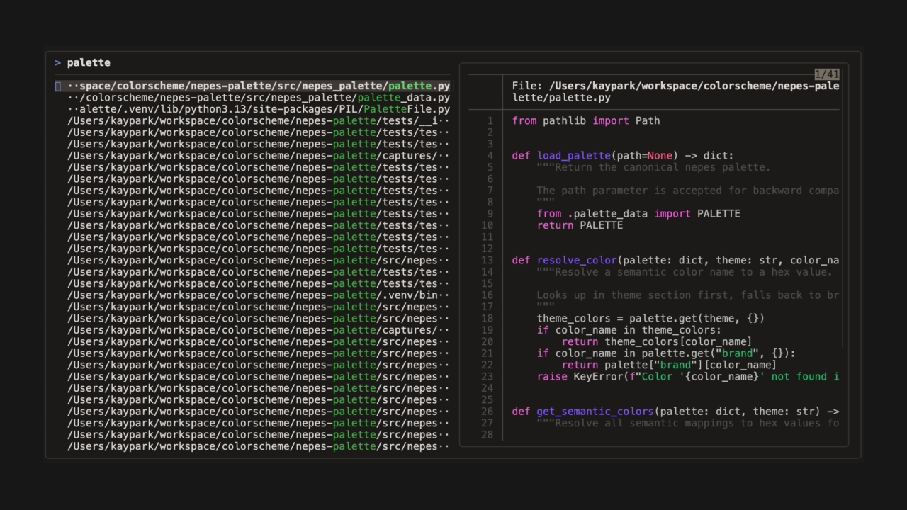
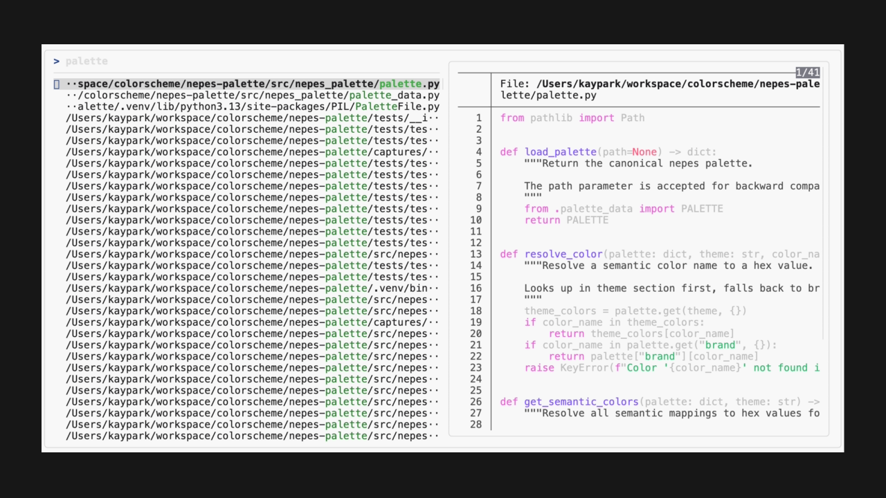
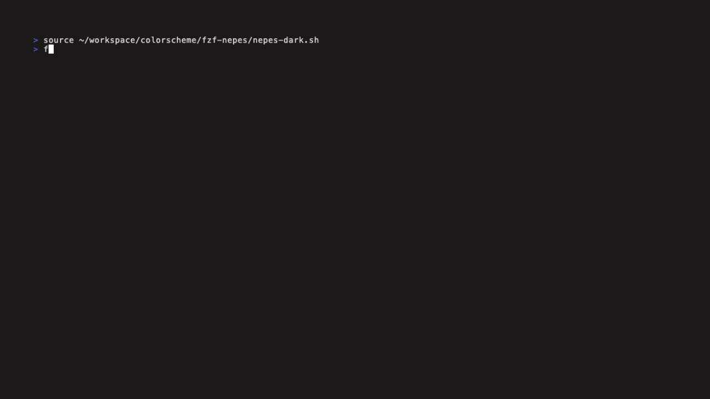
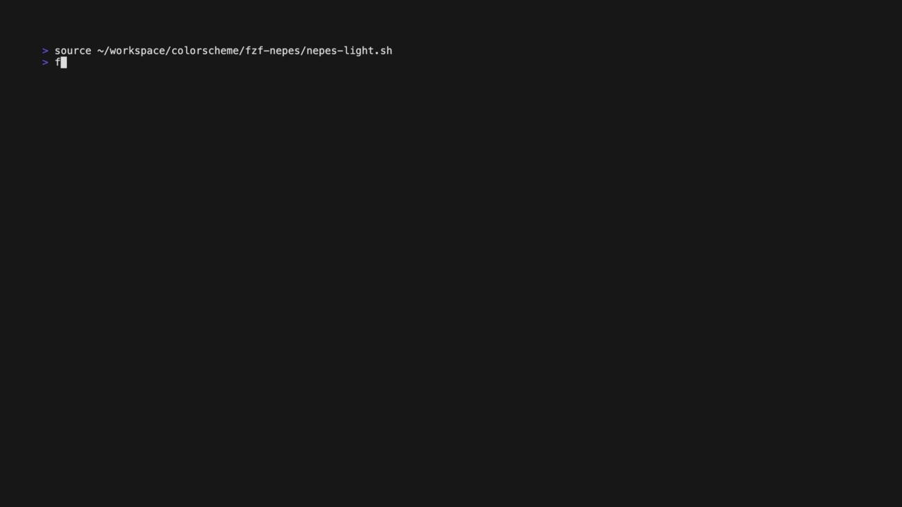

#+title: fzf-nepes
#+description: Nepes color theme for fzf

Command-line fuzzy finder.

Part of the [[https://github.com/kayspark][Nepes Colorscheme]] suite.

* Screenshots

| Dark | Light |
|------+-------|
|  |  |

** Demo

| Dark | Light |
|------+-------|
|  |  |

* Installation

1. Clone this repo
2. Source the theme in your shell RC:
#+begin_src shell
source /path/to/fzf-nepes/nepes-dark.sh
#+end_src

* Credits

Generated by [[https://github.com/kayspark/nepes-palette][nepes-palette]].
